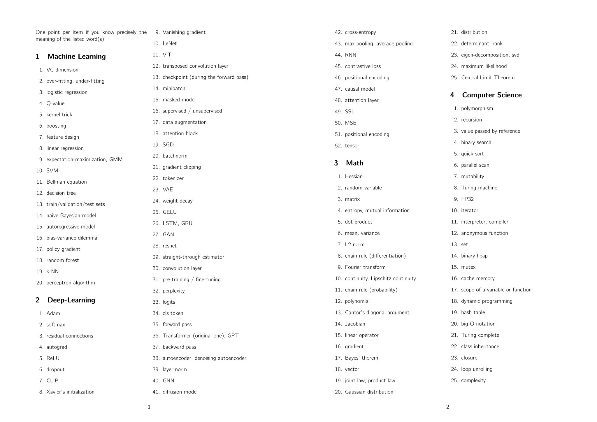

## Repository Overview

This repository is based on the insights shared by Professor François Fleuret. For more details, you can view his original tweet [here](https://twitter.com/francoisfleuret/status/1783384529115230346).

# Math Glossary

### Hessian
The Hessian matrix is a square matrix of second-order partial derivatives of a scalar-valued function. It describes the local curvature of a function of many variables.

### Random Variable
A random variable is a variable whose possible values are numerical outcomes of a random phenomenon. There are two types of random variables: discrete and continuous.

### Matrix
A matrix is a rectangular array of numbers or other mathematical objects, for which operations such as addition and multiplication are defined. Matrices are fundamental to modern science and engineering.

### Entropy
In information theory, entropy is a measure of the unpredictability or the randomness of information content.

### Mutual Information
Mutual information measures the amount of information that can be obtained about one random variable by observing another.

### Dot Product
-------------------

> Discrete Mathematics
- Definition: An algebraic operation that takes two sequences of numbers or two sets of homogenous number of elements (e.g., $u_n$ and $v_n$) and returns a scalar obtained by multiplying corresponding entries (or elements), and then summing the resulting products.
- Formula (uses $Riemann's Sum Notation$): $\sum_{i=0}^{n} u_i v_i = u_0 v_0+u_1 v_1+u_2 v_2+...+u_{n-1} v_{n-1} +u_n v_n$ 

> Euclidean Geometry (Vector maths)
- Definition: Recall, vector $(u)$ and vector $(v)$ are intersecting vectors at a point $(p)$, then it follows that the sum of the products of their corresponding vector components is known as the "dot product", and following the proof, it can be stated that this is equivalent to multiplying the vector norms together with cosine the inscribed angle between them.
- Formula: u.v = $[u_0, u_1, u_2].[v_0, v_1, v_2]$ = $u_0 v_0 + u_1 v_1 + u_2 v_2$ = $||u|| * ||v|| * cos(a)$; where (<a) is the inscribed angle between vector $(u)$ and vector $(v)$ in an Euclidean vector-space.

> Usages: 
- Finding the work done by a force vector $(F)$ to move an object a displacement $(D)$ with an inscribed angle $(a)$, formula: $W = F.D = ||F|| * ||D|| x cos(a) = \sum_{i=0}^{n} u_i v_i = u_0 v_0+u_1 v_1+u_2 v_2+...+ u_{n-1} v_{n-1} + u_n v_n$ (Physics).
- Finding the inscribed angle (<a) between 2 intersecting vectors, formula: m(<a) $= acos(u.v/(||u|| * ||v||))$; where u.v can be evaluated using the Riemann's sum formula (Trigo./Physics).
- Finding whether 2 intersecting vectors are orthogonal, formula: $u.v = ||u|| * ||v|| * cos(PI/2)$ = ZERO (Geometry).
- Finding projection vectors, formula: "the vector projection of $u$ onto $v$" $proj_{v}^{u} = (||u|| * cos(a)) * (v/||v||) = (u.v / ||v||^2) * v$; where $(||u|| * cos(a))$ is the length of the triangle base, and $(v/||v||)$ is the unit vector form (normalized) of $v$.
- Finding the total electromotive force (EMF) in a closed circuit loop, formula: $V = I * R * cos(0)$ (aka. Ohm's Law).
- Finding the driving arterial blood pressure in a closed arterial circuitry, formula: $BP = CO * SVR * cos(0)$ (Hemodynamics).

> Proofs:
- From the $"Law of Cousines"$, formula: $||w||^2 = ||u||^2 + ||v||^2 - 2 ||u|| * ||v|| * cos(a)$.

> Compare: 
- Vector (Cross) Product (aka. Product Set in discrete mathematics).
- Triple Scalar (or Box Product).

> References: 
- Thomas' Calculus 14e: Ch.12 Vectors & Geometry of Space: Section.12.3. (The Dot Product).

-------------------
### Mean
The mean or average is the central value of a discrete set of numbers, specifically, the sum of the values divided by the number of values.

### Variance
Variance is a measure of the dispersion of a set of data points around their mean value. It is a mathematical expectation of the average squared deviations from the mean.

### L2 Norm
The L2 norm is the Euclidean norm, which represents the length of a vector in Euclidean space, calculated from the square root of the sum of the squared vector components.

### Chain Rule (Differentiation)
-------------------

> Definition:
- The chain rule is a formula to compute the derivative of a composite function, by multiplying the derivative of the compositor function
by the derivative of its substrate (base) function; it deals with the substrate function as if it were a scalar function that scales the value of the compositor function;
on the graph, the function is curved in terms of the substrate function.

> Formula:
- If u is a dummy (arbitrary) variable, it follows that if
$ƒ(u)$ is differentiable at the point $u = g(x)$ and $g(x)$ is differentiable at $x$, then the composite function $(ƒ ∘ g) (x) = ƒ(g(x))$ is
differentiable at $x$, and: $(ƒ ∘ g)′(x) = ƒ′(g(x)).g′(x)$ or $d(ƒ ∘ g)(x)/d(x) = [df(u)/ d(u)] . [dg(x)/d(x)]$ in _Leibniz's notation_.

> Usages:
- Quick-finds the derivative of a composite functions, if both functions are known (though you can still differentiate $(ƒ ∘ g)(x)$ directly).
- Complex analysis of a function in terms of other functions (Application of multiple functions on the same object).

> Steps to prove:
1) Envision the following in an Euclidean vector-space $V_I$: 
      - A dummy variable (u).
      - A function $f(u) = 3u^2+1$.
2) Envision the following in another Euclidean vector-space $V_{II}$:
      - A dummy variable (x).
      - A function $g(x) = x-1$.
3) Find the original function $(ƒ ∘ g)(x)$ that lies in $V_I$, but uses scalars from $V_{II}$.
4) Find the derivative of the composite function $(ƒ ∘ g)′(x)$ using limits.
5) Find the derivative of the compositor function $f(u)$.
6) Find the derivative of the substrate $g(x)$.
7) Evaluation of the L.H.S. and the R.H.S. of the _Leibniz's notation_ in a finite-state fashion, by multiplying
_step.04_ and _step.03_, and evaluating the result with _step.02_.

> Compare: 
- Antiderivation of the composite functions.

> References:
- Thomas' Calculus 14-e: Ch.03 Derivatives: Section-3.6 (The Chain Rule).

> Edited by: [@pavl_g](https://github.com/Scrappers-glitch)

-------------------
### Fourier Transform
The Fourier Transform is a mathematical transform that decomposes functions depending on space or time into functions depending on spatial or temporal frequency.

### Continuity
A function is continuous if, at every point in the function's domain, the function's value at that point equals the limit of the function's values at nearby points.

### Lipschitz Continuity
A function is Lipschitz continuous if there exists a real constant such that, for all points in the function's domain, the absolute difference in the function's values at two points is bounded by the product of the absolute difference between the points and the constant.

### Chain Rule (Probability)
The chain rule in probability theory is a fundamental rule calculating the probability of a sequence of events.

### Polynomial
A polynomial is an expression consisting of variables (or indeterminates) and coefficients, that involves only the operations of addition, subtraction, multiplication, and non-negative integer exponents of variables.

### Cantor's Diagonal Argument
Cantor's diagonal argument is a mathematical proof that there are sets which cannot be put into one-to-one correspondence with the natural numbers, such as the set of real numbers, proving it uncountable.

### Jacobian
The Jacobian matrix is the matrix of all first-order partial derivatives of a vector-valued function. It generalizes the gradient of a scalar-valued function.

### Linear Operator
A linear operator is a mapping between two vector spaces that preserves the operations of vector addition and scalar multiplication.

### Gradient
The gradient of a function is a vector field which represents the direction and rate of fastest increase of the function.

### Bayes' Theorem
Bayes' Theorem describes the probability of an event, based on prior knowledge of conditions that might be related to the event.

### Vector
In mathematics and physics, a vector is an element of a vector space. For many specific vector spaces, the vectors have received specific names, which are listed below.

### Joint Law, Product Law
The joint law describes the behavior of two random variables considered together. The product law calculates the joint distribution of two independent random variables.

### Gaussian Distribution
The Gaussian distribution, often called the normal distribution, is an extremely common continuous probability distribution—a function that tells the probability of a number in some context falling between any two real numbers.

### Distribution
In statistics, a distribution is a listing or function showing all the possible values (or intervals) of the data and how often they occur.

### Determinant
The determinant is a scalar value that can be computed from the elements of a square matrix and encodes certain properties of the matrix.

### Rank
The rank of a matrix is the maximum number of linearly independent row vectors in the matrix, which is the same as the maximum number of linearly independent column vectors.

### Eigen-decomposition
Eigen-decomposition is the method of decomposing a square matrix into its eigenvalues and eigenvectors, which is an important tool for simplifying matrix operations and analyzing systems.

### SVD (Singular Value Decomposition)
Singular value decomposition is a factorization of a real or complex matrix that generalizes the eigendecomposition of a square normal matrix to any \(m \times n\) matrix via an extension of the polar decomposition.

### Maximum Likelihood
The maximum likelihood estimation (MLE) is a method of estimating the parameters of a statistical model, given observations, by finding the parameter values that maximize the likelihood of making the observations given the parameters.

### Central Limit Theorem
The central limit theorem states that, in most situations, when a large number of independent random variables are added, their properly normalized sum tends toward a normal distribution, even if the original variables themselves are not normally distributed.
# Computer Science Glossary

### Polymorphism
Polymorphism in computer science refers to the ability of a function or an object to take on many forms. It allows methods to do different things based on the object it is acting upon, essential for achieving abstraction and flexibility in object-oriented programming.

### Recursion
Recursion is a programming technique where a function calls itself directly or indirectly. It's often used to solve problems that can be broken down into simpler, repetitive tasks. It is an effective method for tasks such as traversing data structures like trees and graphs.

### Value Passed by Reference
Passing by reference means that a function receives a reference to the variable itself, rather than a copy of its value. This allows the function to modify the original variable's value directly.

### Binary Search
Binary search is an efficient algorithm for finding an item from a sorted list of items. It works by repeatedly dividing in half the portion of the list that could contain the item, until you've narrowed the possible locations to just one.

### Quick Sort
Quick sort is a divide-and-conquer algorithm that selects a 'pivot' element from the array and partitions the other elements into two sub-arrays, according to whether they are less than or greater than the pivot. The sub-arrays are then sorted recursively.

### Parallel Scan
Parallel scan, also known as parallel prefix sum, is an algorithm used to compute prefix sums efficiently in parallel. It's useful in applications where you need to perform computations on large data arrays in a parallel computing environment.

### Mutability
In computer programming, mutability refers to the ability of an object to be changed after it has been instantiated. Mutable objects have their fields and states changeable, while immutable objects do not allow any alteration after creation.

### Turing Machine
A Turing machine is a mathematical model of computation that defines an abstract machine which manipulates symbols on a strip of tape according to a table of rules. Despite the simplicity of the model, Turing machines can simulate any computer algorithm.

### FP32
FP32 refers to a 32-bit floating-point data type used in computing. It is a standard format for representing and manipulating real numbers in digital computers, particularly in graphics processing and deep learning applications.

### Iterator
An iterator is an object that enables a programmer to traverse a container, particularly lists. Various types of iterators are capable of accessing the data elements of a container in a sequential manner.

### Interpreter vs Compiler
An interpreter directly executes instructions written in a programming or scripting language without previously converting them to an object code or machine code. A compiler, on the other hand, transforms high-level code into machine code that the computer's processor can execute directly.

### Anonymous Function
Also known as lambda functions, anonymous functions are functions that are defined without a name. They are often used for constructing short, ad-hoc functions, and are typically arguments being passed to higher-order functions.

### Set
In computer science, a set is an abstract data type that can store unique values, without any particular order. It is typically used to ensure that no duplicates are entered.

### Binary Heap
A binary heap is a complete binary tree which satisfies the heap ordering property. It can be seen as a binary tree with two additional constraints: the shape property and the heap property, often used in priority queues.

### Mutex
A mutex (mutual exclusion object) is a program object that allows multiple program threads to share the same resource, such as file access, but not simultaneously. When a program is locked by a mutex, no other thread can access the locked region of code until the mutex is unlocked.

### Cache Memory
Cache memory is a small-sized type of volatile computer memory that provides high-speed data storage and access to the processor and stores frequently used data and instructions.

### Scope of a Variable or Function
Scope refers to the visibility of variables and functions in parts of a program. It determines the accessibility of these variables and functions to various parts of the code.

### Dynamic Programming
Dynamic programming is a method for solving complex problems by breaking them down into simpler subproblems. It is applicable where the subproblems are not independent, i.e., when subproblems share subsubproblems. In this context, the technique of storing solutions to subproblems (instead of recomputing them) is used.

### Hash Table
A hash table, or a hash map, is a data structure that implements an associative array abstract data type, a structure that can map keys to values. A hash table uses a hash function to compute an index into an array of buckets or slots, from which the desired value can be found.

### Big-O Notation
Big-O notation is a mathematical notation that describes the limiting behavior of a function when the argument tends towards a particular value or infinity. It is a primary tool in computational complexity theory to classify algorithms according to how their run time or space requirements grow as the input size grows.

### Turing Complete
A system of data-manipulation rules (such as a computer's instruction set, a programming language, or a cellular automaton) is Turing complete if it can be used to simulate any Turing machine. This concept is used to determine the computational equivalence of different systems.

### Class Inheritance
Class inheritance is a feature in object-oriented programming that allows a class to inherit properties and behaviors (methods) from another class. Referred to as a "subclass" or "derived class," the class that inherits is able to extend the functionality of the "base class" or "superclass."

### Closure
In programming, a closure is a technique for implementing lexically scoped name binding in a language with first-class functions. Operationally, a closure is a record storing a function together with an environment that binds each of the function's non-local variables to its corresponding value.

### Loop Unrolling
Loop unrolling is an optimization technique that involves duplicating the body of a loop a certain number of times, reducing the overhead of loop control and increasing the speed of the program.

### Complexity
In computational theory, complexity refers to the amount of resources required for the execution of an algorithm. The more steps (time complexity) or memory (space complexity) an algorithm requires to complete, the more complex it is considered.

# Machine Learning Glossary

### VC Dimension
VC Dimension is a measure of the capacity of a statistical classification model, defined as the size of the largest dataset that can be shattered by the classifier. It helps in understanding the model's ability to generalize to unseen data.

### Over-fitting, Under-fitting
**Over-fitting** occurs when a model learns the detail and noise in the training data to the extent that it negatively impacts the performance of the model on new data. **Under-fitting** occurs when a model cannot capture the underlying trend of the data and fails to perform well even on the training data.

### Logistic Regression
Logistic regression is a statistical model that uses a logistic function to model a binary dependent variable. In regression analysis, logistic regression estimates the parameters of a logistic model, and is used extensively in fields like medicine and social sciences.

### Q-value
In reinforcement learning, the Q-value represents the quality of a particular action taken from a particular state. It provides the expected future rewards for that action taken in that state.

### Kernel Trick
The kernel trick is a method used in machine learning algorithms that allows them to operate in a high-dimensional space without explicitly mapping data points into it. This trick is particularly used in support vector machines.

### Boosting
Boosting is an ensemble technique that improves the prediction strength of a model by combining multiple weak models to create a strong model. Boosting sequentially applies the weak classification algorithm to repeatedly modified versions of the data, producing a sequence of weak classifiers.

### PCA (Principal Component Analysis)
Principal Component Analysis (PCA) is a statistical procedure that uses an orthogonal transformation to convert a set of observations of possibly correlated variables into a set of values of linearly uncorrelated variables called principal components.

### Feature Design
Feature design, or feature engineering, involves creating new features or modifying existing features which can be used to improve the performance of machine learning algorithms.

### Linear Regression
Linear regression is a statistical approach for modeling the relationship between a dependent variable with a given set of independent variables. It is one of the simplest forms of regression analysis.

### Expectation-Maximization, GMM
**Expectation-Maximization (EM)** is an iterative method to find maximum likelihood estimates of parameters in statistical models, where the model depends on unobserved latent variables. **Gaussian Mixture Models (GMMs)** are a probabilistic model for representing normally distributed subpopulations within an overall population.

### SVM (Support Vector Machine)
Support Vector Machine (SVM) is a powerful classification technique that works by finding a hyperplane that best divides a dataset into classes.

### Bellman Equation
The Bellman equation, named after Richard Bellman, is a recursive equation and plays a central role in dynamic programming. It describes the relationship between the value of a decision problem at one point in time and the value at the next time.

### Decision Tree
A decision tree is a decision support tool that uses a tree-like graph of decisions and their possible consequences. It is one way to display an algorithm that only contains conditional control statements.

### Train/Validation/Test Sets
**Training set** is a dataset used to train a model. **Validation set** is a dataset used to provide an unbiased evaluation of a model fit on the training dataset while tuning the model's hyperparameters. **Test set** is a dataset used to provide an unbiased evaluation of a final model fit on the training dataset.

### Naive Bayesian Model
A Naive Bayesian model is a classification technique based on Bayes' Theorem with an assumption of independence among predictors. It is easy to build and particularly useful for very large datasets.

### Autoregressive Model
Autoregressive models are used for modeling time series data, where current values are based on previous time series values.

### Bias-Variance Dilemma
The bias-variance dilemma is the conflict in trying to simultaneously minimize these two sources of error that prevent supervised learning algorithms from generalizing beyond their training set.

### Policy Gradient
Policy gradient methods are a type of reinforcement learning techniques that optimize the parameters of a policy by gradients estimated from the reward received.

### Random Forest
Random Forest is an ensemble learning method for classification, regression, and other tasks, that operates by constructing a multitude of decision trees at training time and outputting the class that is the mode of the classes or mean prediction of the individual trees.

### k-NN (k-Nearest Neighbors)
k-Nearest Neighbors algorithm is a non-parametric method used for classification and regression. In both cases, the input consists of the k closest training examples in the feature space.

### Perceptron Algorithm
The perceptron is one of the simplest types of artificial neural networks and is a linear classifier that classifies data into two parts by a linear separator.

# Deep Learning Glossary

### Adam
Adam (Adaptive Moment Estimation) is an optimization algorithm that combines the advantages of two other extensions of stochastic gradient descent: Adaptive Gradient Algorithm (AdaGrad) and Root Mean Square Propagation (RMSProp). It is designed to handle sparse gradients on noisy problems.

### Softmax
The softmax function, or normalized exponential function, is a generalization of the logistic function that "squashes" a K-dimensional vector of arbitrary real values to a K-dimensional vector of real values in the range (0, 1) that add up to 1. It is used in multinomial logistic regression and is often the last operation done in a network.

### Residual Connections
Residual connections, or shortcuts, help to avoid the vanishing gradient problem in deep networks by allowing gradients to flow through a shortcut path. They are used extensively in deep residual networks (ResNets).

### Autograd
Autograd is a Python library that automatically differentiates native Python and Numpy code. It provides a flexible and efficient system for automatically computing gradients.

### ReLU
Rectified Linear Unit (ReLU) is a type of activation function that is defined as the positive part of its argument, where \(f(x) = max(0, x)\). ReLU is popular because it speeds up training without a significant penalty to generalization accuracy.

### Dropout
Dropout is a technique for addressing overfitting. The key idea is to randomly drop units (along with their connections) from the neural network during training. This prevents units from co-adapting too much.

### CLIP
CLIP (Contrastive Language–Image Pre-training) by OpenAI leverages large amounts of data and computational resources to link images with texts in a way that enables zero-shot classification of images by using natural language.

### Xavier's Initialization
Also known as Glorot initialization, this technique provides an effective way to initialize the weights of a neural network to help prevent the vanishing or exploding gradient problems during training.

### Vanishing Gradient
The vanishing gradient problem occurs when the gradient of the loss function is propagated backward through the network, and the gradient can become vanishingly small, effectively preventing the weights from changing its value.

### LeNet
Developed by Yann LeCun, LeNet was one of the first convolutional neural networks which efficiently applied the gradient-based learning methods to digital images. It was primarily developed for handwriting and character recognition.

### ViT
Vision Transformer (ViT) applies the principles of the transformer architecture, typically used for natural language processing, to image classification tasks.

### Transposed Convolution Layer
Transposed convolutions are used in convolutional neural networks to upsample input feature maps, often as part of a process to increase the resolution of images in tasks like image segmentation.

### Checkpoint (during the forward pass)
Creating checkpoints during the forward pass of training a neural network helps in saving the model's state at intermittent points. This can be used for recovery if the training process is interrupted, or for starting subsequent training runs from a particular state.

### Minibatch
In neural network training, a minibatch is a subset of the training dataset used to train the model for a single iteration. This allows for both efficient computation and more stable convergence in stochastic gradient descent.

### Masked Model
In models such as transformers, masking involves hiding certain elements of the input from the model; this is a critical part of training language models to handle arbitrary input sequences efficiently.

### Supervised / Unsupervised
Supervised learning algorithms are trained using labeled data, while unsupervised learning algorithms are trained using unlabeled data, which allows them to find structure in the input data on their own.

### Data Augmentation
Data augmentation involves artificially increasing the diversity of data available for training models without actually collecting new data. Techniques include rotation, cropping, resizing, and color modification among others.

### Attention Block
In deep learning, especially in models like transformers, attention blocks help the model focus on relevant parts of the input data, improving the accuracy and efficiency of tasks like language translation.

### SGD
Stochastic Gradient Descent (SGD) is a simple yet highly effective approach to fitting linear classifiers and regressors under convex loss functions. It's particularly useful for large-scale and sparse machine learning problems.

### Batchnorm
Batch normalization is a technique to provide any layer in a neural network with inputs that are zero mean/unit variance, and by doing so, helps in speeding up the training of neural networks.

### Gradient Clipping
Gradient clipping involves limiting (or "clipping") the values of gradients during backpropagation to address the exploding gradients problem in training deep neural networks.

### Tokenizer
A tokenizer processes text to break it down into its constituent parts (tokens), which are often words or subwords, making the text more amenable to deep learning models.

### VAE
Variational Autoencoders (VAE) are a type of generative model that use a probabilistic approach to describe observations in a latent space. Unlike standard autoencoders, VAEs are designed to impose a distribution on the latent variables.

### Weight Decay
Weight decay is a regularization technique used to add a small penalty, which is a fraction of weight magnitude, to the loss function. The penalty term is proportional to the square of the value of the weights.

### GELU
The Gaussian Error Linear Unit (GELU) is a non-linear activation function used in deep learning that models the data better on complex tasks like natural language understanding.

### LSTM, GRU
Long Short-Term Memory (LSTM) units and Gated Recurrent Units (GRU) are types of RNN architectures designed to help capture information over extended sequences, useful in applications like time series prediction and natural language processing.

### GAN
Generative Adversarial Networks (GANs) consist of two neural networks, a generator and a discriminator, that are trained simultaneously. The generator's goal is to produce data indistinguishable from real data, while the discriminator tries to differentiate between real and generated data.

### ResNet
Residual Networks (ResNet) are a type of convolutional neural network (CNN) where connections skip one or more layers. They are designed to enable training of extremely deep neural networks to achieve better performance.

### Straight-Through Estimator
The Straight-Through Estimator is a method for backpropagation through discrete variables. It is commonly used for training models that include non-differentiable operations, like quantization.

### Convolution Layer
Convolutional layers are the building blocks of convolutional neural networks (CNNs). These layers apply a convolution operation to the input, passing the result to the next layer.

### Pre-training / Fine-tuning
Pre-training refers to training a neural network model on a large dataset with a general-purpose task before it is fine-tuned on a specific task. This helps in improving the performance of the neural network on tasks that have smaller datasets.

### Perplexity
Perplexity is a measure of how well a probability model predicts a sample, often used to evaluate language models. A lower perplexity score indicates better predictive performance.

### Logits
In the context of neural networks, logits are the raw outputs of the last layer in the network before applying the activation function like softmax.

### CLS Token
In models such as BERT, the CLS token is added to the beginning of each input example and is used as the aggregate representation for classification tasks.

### Forward Pass
The forward pass in a neural network refers to the process of computing the output of the network for a given input by passing it through each layer in turn.

### Transformer (original one), GPT
The Transformer model is a type of architecture that relies solely on attention mechanisms to draw global dependencies between input and output. The Generative Pre-trained Transformer (GPT) is a version of Transformer with a specific training method that uses unsupervised learning, which then can be fine-tuned with supervised learning tasks.

### Backward Pass
The backward pass in neural networks is the process where gradients are computed for network parameters, typically used for training via backpropagation.

### Autoencoder, Denoising Autoencoder
An autoencoder is a type of neural network used to learn efficient encodings. The denoising autoencoder is a variant that is trained to use the encoded representation to reconstruct the input from a corrupted version of it.

### Layer Norm
Layer normalization is a technique that normalizes the inputs across the features instead of the batch in neural networks. It is particularly useful in recurrent neural networks.

### GNN
Graph Neural Networks (GNNs) are designed to process data that is represented as graphs, enabling new forms of learning where the model can take graph structure into account.

### Learning Rate Schedule
A learning rate schedule modifies the learning rate during training, typically reducing the rate according to a predefined schedule. This helps in optimizing the training process.

### Diffusion Model
Diffusion models are a type of generative model that constructs data by starting from noise and gradually shaping it towards the data distribution through a process known as denoising.

### Cross-Entropy
Cross-entropy is a measure from the field of information theory, building upon entropy and generally used to quantify the difference between two probability distributions.

### Max Pooling, Average Pooling
Pooling layers downsample each feature map in the network, reducing the dimensions and allowing for assumptions to be made about features contained in the sub-regions binned. Max pooling and average pooling are techniques to perform this downsampling by taking the maximum and average value, respectively, in each patch of the feature map.

### RNN
Recurrent Neural Networks (RNNs) are a class of neural networks where connections between units form a directed cycle. This creates an internal state of the network which allows it to exhibit dynamic temporal behavior.

### Contrastive Loss
Contrastive loss is used in learning algorithms that aim to learn from the similarity and dissimilarity between pairs of samples, commonly used in tasks like image captioning and face verification.

### Positional Encoding
Positional encoding is used in Transformer models to give the model information about the relative or absolute positioning of the tokens in the input sequences.

### Causal Model
Causal models in deep learning are used to understand and manage the cause and effect relationships. They are crucial for decision-making processes where predictions or simulations of potential outcomes are needed.

### Attention Layer
An attention layer is a component in neural network architectures that weighs the input features of the data based on their importance to the task at hand. It is a key component of models that require focus on specific aspects of the input data, such as models that involve natural language processing.

### SSL (Self-Supervised Learning)
Self-supervised learning is a form of unsupervised learning where the data provides the supervision. It involves creating a pretext task, such as predicting the next word in a sentence, to help the model learn the proper context and features from the data.

### MSE (Mean Squared Error)
Mean Squared Error (MSE) is a common loss function used in regression problems. It measures the average squared difference between the estimated values and what is estimated.

### Tensor
In the context of machine learning, a tensor is a generalization of vectors and matrices to potentially higher dimensions, and is a primary data structure used in neural networks.

